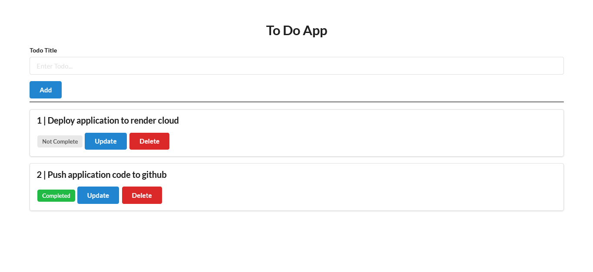

# Gin Todo Application


Tasks todo web application with a minimal features created using gin framework.

## Installation
Clone the repository using `git`
```
git clone https://github.com/Prakashdeveloper03/Gin-todo-app.git
```
Change to the cloned directory
```
cd <directory_name>
```
To install all requirement packages for the app
```
go mod download
```
Then, Run the app
```
go run main.go
```

## 📷 Screenshots
